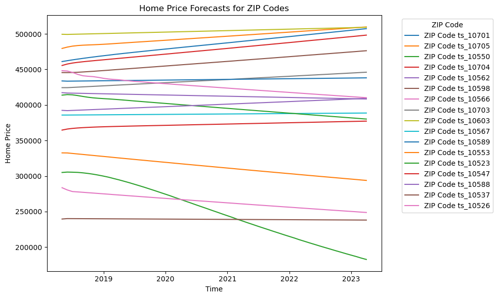
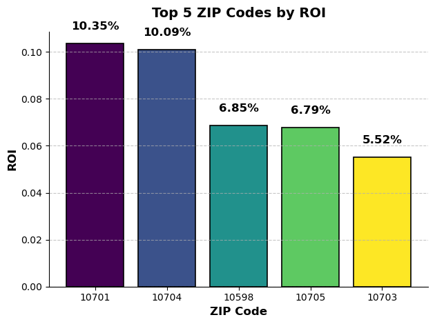

# Business Understanding
* Objective: Identify five ZIP codes in Westchester County where a client can purchase a home within a $500,000 budget, aiming for optimal Return on Investment (ROI) over a 5-year period.
* Stakeholder: A prospective homebuyer seeking a property in Westchester County that not only fits within their financial constraints but also promises substantial appreciation.
* Problem: Determining which ZIP codes in Westchester County offer homes priced at or below $500,000 and are projected to yield the highest ROI over a 5-year span.

Key Questions
1. Which ZIP codes in Westchester County have homes available within the $500,000 budget?
2. What are the historical and projected real estate trends in these ZIP codes?
3. Which of these areas are anticipated to provide the highest ROI over the next 10 years?

Success Metric: ROI (Return on Investment) over a 5-year period.

Model Evaluation Metric: AIC

# Data Understanding
The data set we are usuing is from [Zillow](https://www.zillow.com/research/data/) and contains historical home prices across the US from 1996 to 2018.
The columns are:
* RegionID
* RegionName
* City
* State Metro
* CountyName
* SizeRank
* Dates and their median home prices

## Data Preparation
* Filter for zipcodes in Westchester
* Filter for zipcodes where the median home price in 2018 is under $500K (our client's buddget).
* Melt data to create a long format instead of a wide format.

# Exploratory Data Analysis
We used AutoArima to forecast home prices for the next 5 years for the zipcodes in Westchester within our client's budget.

# Conclusion

The top zipcodes by expected ROI over 5 years are:
10701 - Yonkers
10704 - Yonkers
10598 - Yorktown
10705 - Yonkers
10703 - Yonkers

## Limitations
This SARIMAX model has a few limitations. 
* The data only goes up to 2018, missing recent market trends. 
* The model assumes linear relationships and normally distributed residuals, though slight non-normality and outliers were observed. It also excludes external factors like interest rates and economic indicators, which could improve accuracy. Auto-ARIMA’s reliance on AIC for model selection may lead to overfitting or underfitting. 
* Lastly, the $500K budget filter doesn’t account for additional costs like property taxes or renovations, which affect ROI.

## Recommendations
Based on the time series analysis and SARIMA modeling, we identified ZIP codes in Westchester County with homes priced at or below $500K and projected their home prices over the next 5 years. By calculating the expected ROI for each ZIP code, we can now highlight the top 5 areas that present the most promising investment opportunities for our client.

## Next Steps
Enhance the Forecasting Model:
* Add exogenous variables (like interest rates, employment rates, and population growth) to further refine the forecast.
* Create model using Facebook’s Prophet and use it for comparison
 
# Links
More details on the analysis can be found [here](https://github.com/hannahdallas/zillow_time_series_model/blob/main/notebook.ipynb)
The presentation can be found [here](https://docs.google.com/presentation/d/1UnwhOtG6VXyiT7JYCG60OG-SGA8XWjSGLtsaN6632Xw/edit#slide=id.p6)

├── zillow_data.csv   
├── images/              
├── README.md           
├── presentation.pdf      
└── notebook.ipynb  